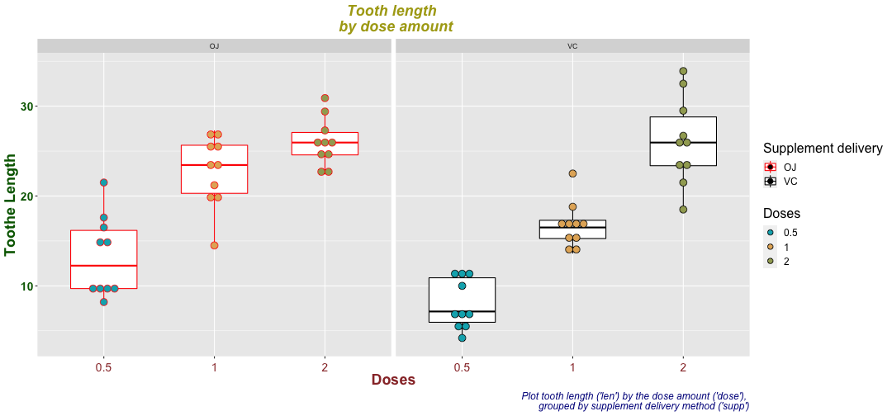

</br></br></br>

# Reproducible Pitch
## Production for Coursera assignement (Course 9 - Week 4)
#### Author : Idriss .S
#### Date : 12 april 2022

--- &vertical

### Introduction

This presentation aims to study a data set from R : `ToothGrowth`.

It's cover :

1. only data exploration (due to the limitation of 5 slides) ;

</br>

This work could be completed (of more slides are allowed) by :

2. fitting model responding to the question that try to explain the relationship 
between miles per gallon consmption and weight for each car.
3. discussions

</br>

### Exploratory data analysis

#### Data structure


```r
data(ToothGrowth)
str(ToothGrowth)
```

```
## 'data.frame':	60 obs. of  3 variables:
##  $ len : num  4.2 11.5 7.3 5.8 6.4 10 11.2 11.2 5.2 7 ...
##  $ supp: Factor w/ 2 levels "OJ","VC": 2 2 2 2 2 2 2 2 2 2 ...
##  $ dose: num  0.5 0.5 0.5 0.5 0.5 0.5 0.5 0.5 0.5 0.5 ...
```

***

#### Data structure - 2

```r
library(tidyr)
library(rstatix)
ToothGrowth %>% sample_n_by(dose, size = 3)
```

```
## # A tibble: 9 × 3
##     len supp   dose
##   <dbl> <fct> <dbl>
## 1  17.6 OJ      0.5
## 2  11.2 VC      0.5
## 3   5.8 VC      0.5
## 4  14.5 VC      1  
## 5  17.3 VC      1  
## 6  14.5 OJ      1  
## 7  29.5 VC      2  
## 8  25.5 OJ      2  
## 9  25.5 VC      2
```

```r
# Quick summary of the data
summary(ToothGrowth)
```

```
##       len        supp         dose      
##  Min.   : 4.20   OJ:30   Min.   :0.500  
##  1st Qu.:13.07   VC:30   1st Qu.:0.500  
##  Median :19.25           Median :1.000  
##  Mean   :18.81           Mean   :1.167  
##  3rd Qu.:25.27           3rd Qu.:2.000  
##  Max.   :33.90           Max.   :2.000
```

***
#### Data structure - 3

```r
# Exploration of ToothGrowth$dose and ToothGrowth$len, since we know exactly what ToothGrowth$supp contains
unique(ToothGrowth$dose)
```

```
## [1] 0.5 1.0 2.0
```

```r
unique(ToothGrowth$len)
```

```
##  [1]  4.2 11.5  7.3  5.8  6.4 10.0 11.2  5.2  7.0 16.5 15.2 17.3 22.5 13.6 14.5
## [16] 18.8 15.5 23.6 18.5 33.9 25.5 26.4 32.5 26.7 21.5 23.3 29.5 17.6  9.7  8.2
## [31]  9.4 19.7 20.0 25.2 25.8 21.2 27.3 22.4 24.5 24.8 30.9 29.4 23.0
```

#### Box plot - code


```r
library(ggplot2)
my_plot_fun <- function(my_data,my_x) {
  my_data <- as.data.frame(my_data)
  my_data %>%
  ggplot(aes(x=my_x, y=len)) +
theme(plot.title = element_text(color="#ADA717", size=18, face="bold.italic",hjust=0.5),
 axis.title.x = element_text(color="#993333", size=18, face="bold"),
 axis.text.x = element_text(color="#993333", size=14,vjust = 0),
 axis.title.y = element_text(color="darkgreen", size=18, face="bold"),
 axis.text.y = element_text(face="bold", color="darkgreen", size=14),
 legend.text = element_text(size=12),
 legend.title = element_text(size=16))}

# Conversion of ToothGrowth$dose into a factor
ToothGrowth$dose<-as.factor(ToothGrowth$dose)

mpt <-my_plot_fun(ToothGrowth,my_x = ToothGrowth$dose) + 
  geom_boxplot(aes(color = supp,group=dose), width = 0.6) +
  geom_dotplot(aes(fill = as.factor(dose), color = supp,group=dose), binaxis='y', stackdir='center', 
               dotsize = 0.8,position = position_dodge(0.8),binwidth=1)+
  scale_fill_manual( values = c("#00AFBB", "#E3B166","#A1A861"))+
  scale_color_manual(values = c("red", "black")) + facet_grid(~ supp)+
  labs(x = "Doses", y ="Toothe Length", fill = "Doses", color="Supplement delivery",
    title = "Tooth length \n by dose amount",
  caption = "Plot tooth length ('len') by the dose amount ('dose'), \n grouped by supplement delivery method ('supp')") +
  theme(plot.caption = element_text(color = "darkblue", face = "italic", size = 12))
```

***
#### Box plot - plot


```r
mpt
```



</br>

#### Thanks for watching. Regards.
##### Idriss .S
